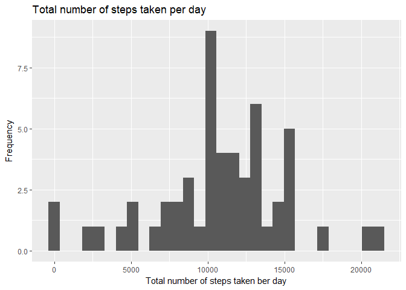
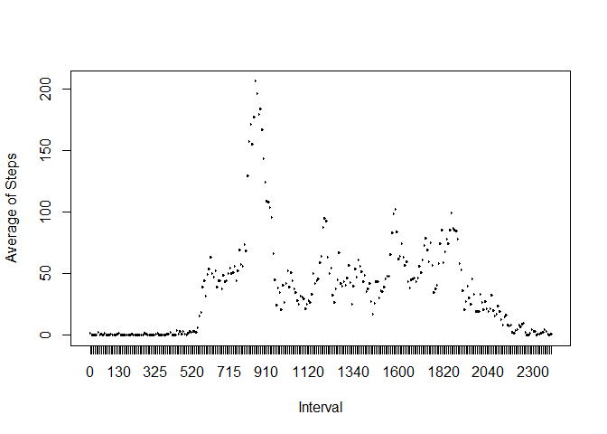
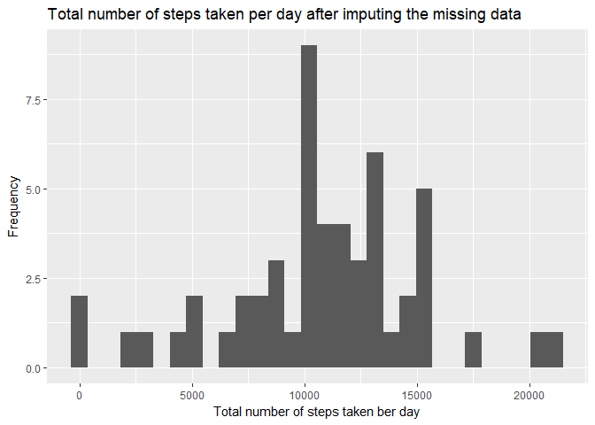
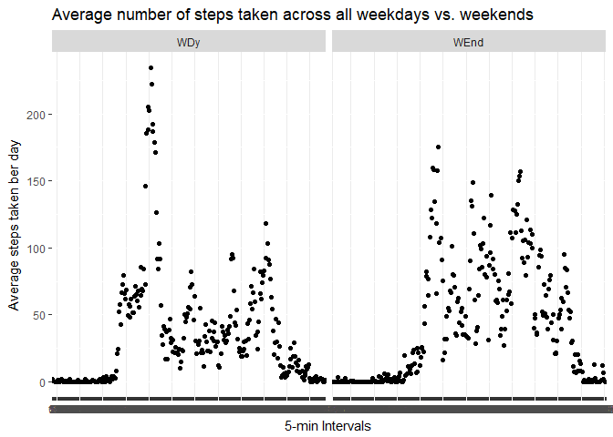

## Loading and preprocessing the data

First, we load the dataset of the personal movement using activity monitoring devices.  


```r
unzip(zipfile = "activity.zip")

Activity_data <- read.csv("activity.csv", header = TRUE)
```


Second, we transform the variables to be suitable for the coming tasks. 
We transform the variable **date** into date format and then use the function **weekdays** to get the corresponding days for everyday.


```r
Activity_data$date<-as.Date.factor(Activity_data$date)

WeekDys<- weekdays(Activity_data$date)

Activity_data<-cbind(Activity_data,WeekDys)

names(Activity_data)[4]<-"Weekdy"

Activity_data$interval<-as.factor(Activity_data$interval)
```


## What is mean total number of steps taken per day?

Calculate the total number of steps taken ber day using **sum** function. We first summarize the **data** and **steps** pair of variables to get the total number of steps taken every day.


```r
library(ggplot2)
```

```
## Warning: package 'ggplot2' was built under R version 3.4.4
```

```r
StepsBerDy<- aggregate(steps~date, data = Activity_data, FUN = sum, na.rm=TRUE)
n <- ggplot(data = StepsBerDy, aes(steps))+ geom_histogram()
n +xlab("Total number of steps taken ber day")+ ylab("Frequency")+ggtitle("Total number of steps taken per day")
```

```
## `stat_bin()` using `bins = 30`. Pick better value with `binwidth`.
```

<!-- -->

So far, we calculated the total number of steps taken ber day in the previuos section. Now, we need to calculate the mean and the median of the total number of steps


```r
Tot_mean <- mean(StepsBerDy$steps)
Tot_med <- median(StepsBerDy$steps)
Tot_mean
```

[1] 10766.19

```r
Tot_med
```

[1] 10765
 
So, we can notice that the values of the mean and the median of the total number of steps do not have a big difference!

## What is the average daily activity pattern?


```r
library(ggplot2)

 AvgStepsBerInv<-aggregate(steps~interval, data = Activity_data, FUN = mean, na.rm=TRUE)
 
plot(AvgStepsBerInv$interval, AvgStepsBerInv$steps,type = "l", xlab="Interval", ylab="Average of Steps", title="The average daily activity pattern",col="red")
```

<!-- -->

We can also figure out which 5-min interval that contains the maximum number of steps with **which.max** function.


```r
AvgStepsBerInv[which.max(AvgStepsBerInv$steps),]
```

    interval    steps
104      835 206.1698

## Imputing missing values

We first calculate the total number of missing values in all of the observations


```r
TotNA<- with(Activity_data,sum(is.na(steps)))
```


So 2304 out of 17568 observations have no values(NA). As well, if we view the activity dataset we can notice that those missing variables are concentrated in only particular days like **2012-10-01** and **2012-11-30**. On the other hand, the other days have no missing data.


```r
library(tidyverse)
```

```
## Warning: package 'tidyverse' was built under R version 3.4.4
```

```
## -- Attaching packages ---------------------------------- tidyverse 1.2.1 --
```

```
## v tibble  1.4.2     v purrr   0.2.4
## v tidyr   0.7.2     v dplyr   0.7.4
## v readr   1.1.1     v stringr 1.2.0
## v tibble  1.4.2     v forcats 0.3.0
```

```
## Warning: package 'tibble' was built under R version 3.4.4
```

```
## Warning: package 'tidyr' was built under R version 3.4.3
```

```
## Warning: package 'readr' was built under R version 3.4.3
```

```
## Warning: package 'purrr' was built under R version 3.4.3
```

```
## Warning: package 'dplyr' was built under R version 3.4.3
```

```
## Warning: package 'stringr' was built under R version 3.4.2
```

```
## Warning: package 'forcats' was built under R version 3.4.4
```

```
## -- Conflicts ------------------------------------- tidyverse_conflicts() --
## x dplyr::filter() masks stats::filter()
## x dplyr::lag()    masks stats::lag()
```

```r
L<-split(Activity_data,as.factor(Activity_data$date))
map(L, ~sum(is.na(.)))
```

$`2012-10-01`
[1] 288

$`2012-10-02`
[1] 0

$`2012-10-03`
[1] 0

$`2012-10-04`
[1] 0

$`2012-10-05`
[1] 0

$`2012-10-06`
[1] 0

$`2012-10-07`
[1] 0

$`2012-10-08`
[1] 288

$`2012-10-09`
[1] 0

$`2012-10-10`
[1] 0

$`2012-10-11`
[1] 0

$`2012-10-12`
[1] 0

$`2012-10-13`
[1] 0

$`2012-10-14`
[1] 0

$`2012-10-15`
[1] 0

$`2012-10-16`
[1] 0

$`2012-10-17`
[1] 0

$`2012-10-18`
[1] 0

$`2012-10-19`
[1] 0

$`2012-10-20`
[1] 0

$`2012-10-21`
[1] 0

$`2012-10-22`
[1] 0

$`2012-10-23`
[1] 0

$`2012-10-24`
[1] 0

$`2012-10-25`
[1] 0

$`2012-10-26`
[1] 0

$`2012-10-27`
[1] 0

$`2012-10-28`
[1] 0

$`2012-10-29`
[1] 0

$`2012-10-30`
[1] 0

$`2012-10-31`
[1] 0

$`2012-11-01`
[1] 288

$`2012-11-02`
[1] 0

$`2012-11-03`
[1] 0

$`2012-11-04`
[1] 288

$`2012-11-05`
[1] 0

$`2012-11-06`
[1] 0

$`2012-11-07`
[1] 0

$`2012-11-08`
[1] 0

$`2012-11-09`
[1] 288

$`2012-11-10`
[1] 288

$`2012-11-11`
[1] 0

$`2012-11-12`
[1] 0

$`2012-11-13`
[1] 0

$`2012-11-14`
[1] 288

$`2012-11-15`
[1] 0

$`2012-11-16`
[1] 0

$`2012-11-17`
[1] 0

$`2012-11-18`
[1] 0

$`2012-11-19`
[1] 0

$`2012-11-20`
[1] 0

$`2012-11-21`
[1] 0

$`2012-11-22`
[1] 0

$`2012-11-23`
[1] 0

$`2012-11-24`
[1] 0

$`2012-11-25`
[1] 0

$`2012-11-26`
[1] 0

$`2012-11-27`
[1] 0

$`2012-11-28`
[1] 0

$`2012-11-29`
[1] 0

$`2012-11-30`
[1] 288
 
It looks like that in some days the participants did not excersize or there was a problem in recording the activity! 

In this case, I think the most efficient strategy to deal with those days that are fully missing the number of steps is to omit or ignor them since they are only present in particular days. There is no point to take the 


```r
Mod_data<-Activity_data[!is.na(Activity_data$steps),]
```


Now, let's explore the distribution of our data after omitting the observations with missing values.


```r
library(ggplot2)

StepsBerDy2<- aggregate(steps~date, data = Mod_data, FUN = sum)
n <- ggplot(data = StepsBerDy2, aes(steps))+ geom_histogram()
n +xlab("Total number of steps taken ber day")+ ylab("Frequency")+ggtitle("Total number of steps taken per day after imputing the missing data")
```

```
## `stat_bin()` using `bins = 30`. Pick better value with `binwidth`.
```

<!-- -->

Not surprisingly, we can see that there was no noticable difference between the two histograms before and after imputing the missing data. That, indeed, occures because we the graphic system of ggplot package, by defult, ignors the missing data exactly as we did in the last step of the analysis. 


```r
Tot_mean2 <- mean(StepsBerDy2$steps)
Tot_med2 <- median(StepsBerDy2$steps)
Tot_mean
```

[1] 10766.19

```r
Tot_med
```

[1] 10765


## Are there differences in activity patterns between weekdays and weekends?

In this section, we use the package **timeDate** functions to check whether a given day is weekday or weekend! After that, we explore the activity distribution in weekdays and weekends as following:


```r
##install.packages("timeDate")
library(timeDate)
```

```
## Warning: package 'timeDate' was built under R version 3.4.4
```

```r
library(dplyr)


Mod_data2<- Mod_data %>% mutate(DyType=as.factor(ifelse(isWeekday(Mod_data$date),"WDy","WEnd")))
```

```
## Warning: package 'bindrcpp' was built under R version 3.4.3
```

```r
Avg_data<- Mod_data2 %>% group_by(DyType,interval) %>% summarise(avgsteps=mean(steps))


## average number of steps taken, averaged across all weekday days or weekend days 

t<- ggplot(Avg_data, aes(x=interval,y=avgsteps))
t+ geom_jitter() + facet_wrap(~ DyType)+xlab("5-min Intervals") + ylab("Average steps taken ber day")+ggtitle("Average number of steps taken across all weekdays vs. weekends"
)
```

<!-- -->


